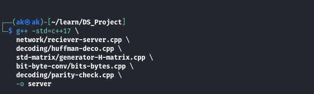
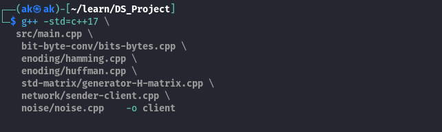
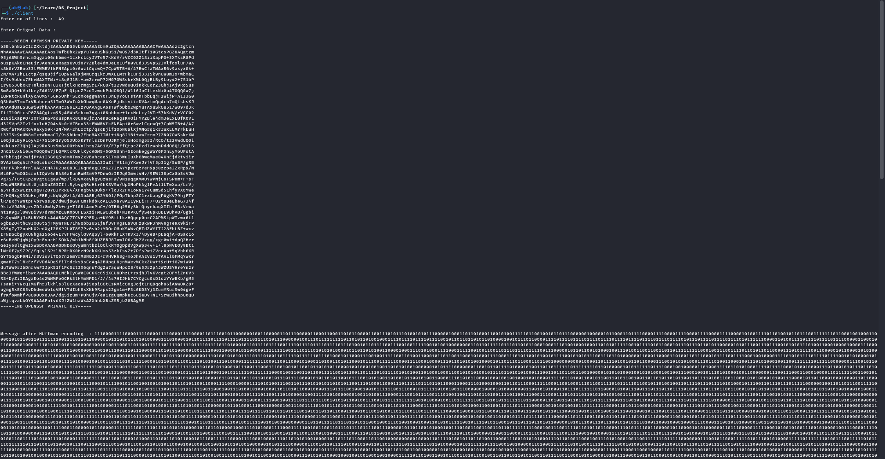
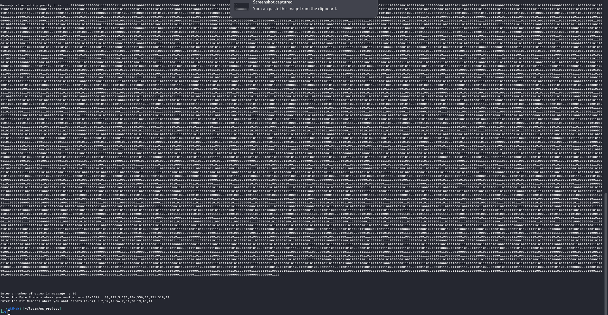
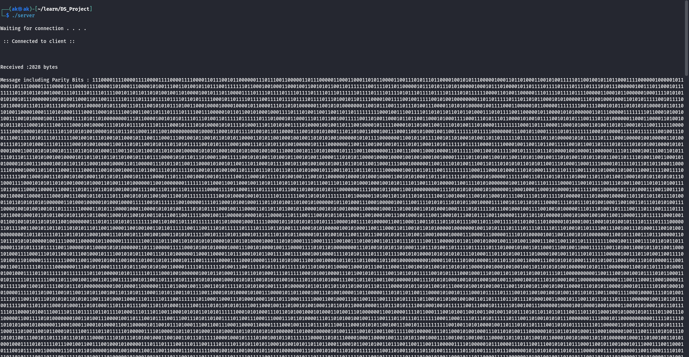
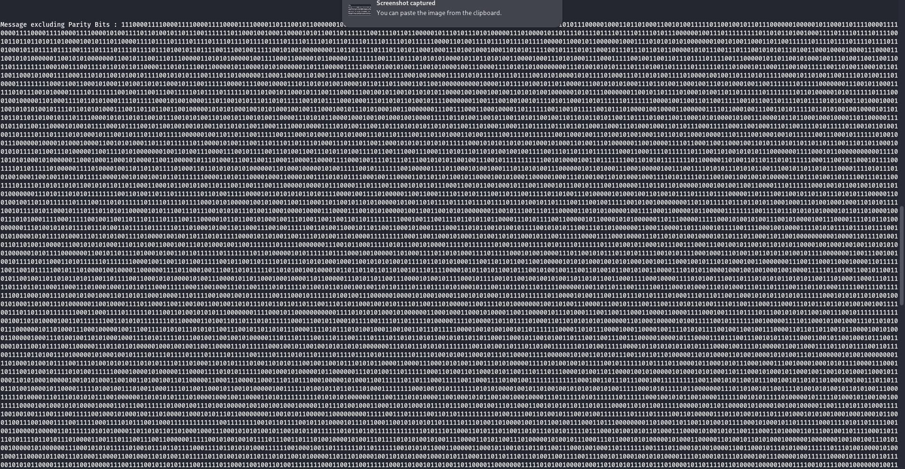
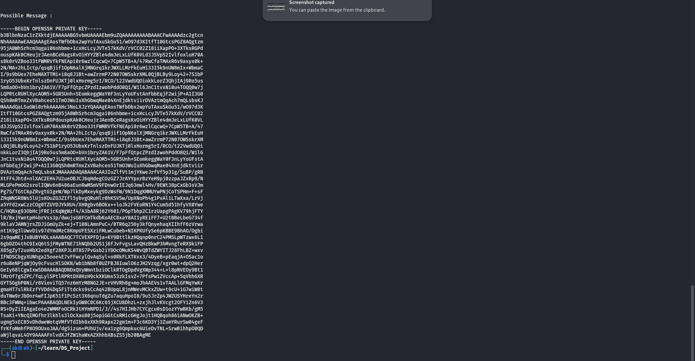

# BitShield — Reliable Data Transmission using Huffman & Hamming Codes

**A Discrete Mathematics–based project implementing Huffman compression and Hamming error-correction (63,57) in a client–server transmission model with noise simulation.**

---

## Abstract

BitShield demonstrates how discrete mathematics (binary algebra, matrices, trees, and coding theory) underpins reliable and efficient data transmission. Messages are compressed using **Huffman coding**, encoded for error correction using **Hamming (63,57)** via generator and parity-check matrices, transmitted through a simulated noisy channel, then received, corrected, and decompressed. The implementation is modular C++17 organized as a client/server pair.

---

## Project layout (actual repo)

```
.
├── bit-byte-conv
│   ├── bits-bytes.cpp
│   └── bits-bytes.h
├── client                # compiled client binary (after build)
├── decoding
│   ├── huffman-deco.cpp
│   ├── huffman-deco.h
│   ├── parity-check.cpp
│   └── parity-check.h
├── enoding
│   ├── hamming.cpp
│   ├── hamming.h
│   ├── huffman.cpp
│   └── huffman.h
├── network
│   ├── reciever-server.cpp
│   ├── reciever-server.h
│   ├── sender-client.cpp
│   └── sender-client.h
├── noise
│   ├── noise.cpp
│   └── noise.h
├── server                # compiled server binary (after build)
├── src
│   └── main.cpp
└── std-matrix
    ├── generator-H.h
    └── generator-H-matrix.cpp
```

---

## Build & Run

**Compile client**

```bash
g++ -std=c++17 \
 src/main.cpp \
 bit-byte-conv/bits-bytes.cpp \
 enoding/hamming.cpp \
 enoding/huffman.cpp \
 std-matrix/generator-H-matrix.cpp \
 network/sender-client.cpp \
 noise/noise.cpp -o client
```

**Compile server**

```bash
g++ -std=c++17 \
 network/reciever-server.cpp \
 decoding/huffman-deco.cpp \
 std-matrix/generator-H-matrix.cpp \
 bit-byte-conv/bits-bytes.cpp \
 decoding/parity-check.cpp -o server
```

**Run**

```bash
./server &
./client
```
## Example Test Case Sending a SSH-Private key















---

## High-level workflow (plain)

1. **Input**: User types message(s) in client.
2. **Huffman**: Build frequency table → build Huffman tree → generate bit codes → produce bitstream.
3. **Hamming (encode)**: Break bitstream into 57-bit blocks, pad, convert each 57→63 via generator matrix G (mod 2).
4. **Pack bits → bytes**: Convert bit vector to bytes for socket transmission.
5. **Noise**: `addnoise` flips user-chosen bit(s) within blocks to simulate errors.
6. **Transmit**: Client sends integer metadata (original bit length), data bytes, Huffman alphabet and frequencies.
7. **Receive**: Server unpacks bytes → converts back to bit vector → split into 63-bit blocks → compute syndrome s = H·cᵀ (mod 2) → if s ≠ 0, correct single-bit error by matching s to column of H.
8. **Strip parity bits**: Remove parity bits from each corrected 63-bit block, reassemble 57-bit data blocks, remove padding to original bit length.
9. **Huffman decode**: Use received alphabet & frequencies to rebuild tree and decode bitstream to original characters.
10. **Output**: Server prints recovered message.

---

## Mathematical foundations (discrete math)

### Notation

* Bits are elements of GF(2) (field with two elements). All arithmetic on codewords and matrices is modulo 2.
* Vectors and matrices use boolean operations with `+` ≡ XOR, `·` ≡ AND for bit multiplications inside sums, and summations reduced mod 2.

### Huffman coding (greedy + tree)

* Frequency counts → priority queue (min-heap) → repeatedly merge two least-frequent nodes.
* Produces a prefix-free binary code that minimizes expected code length: expected length ( L = \sum p_i \ell_i ).
* Tree traversal: left edge = 0, right edge = 1 (implementation choice).

### Hamming codes (linear block codes)

* (n, k) Hamming-like linear code used here: **(63,57)** (n = 63 total bits, k = 57 data bits, r = 6 parity bits).
* Generator matrix ( G ) (size ( k \times n )) maps a data row vector ( w ) (1×k) to a codeword: ( c = wG ) (mod 2).
* Parity-check matrix ( H ) (size r × n) satisfies ( H c^T = 0 ) for every codeword ( c ) in the code.
* Syndrome ( s = H c_{\text{received}}^T ): if ( s = 0 ) no error; if ( s \neq 0 ), its vector equals the column of H corresponding to the single erroneous bit index → flip that bit to correct.

#### Properties used:

* Single-bit error correction if minimum Hamming distance ( d_{\min} \ge 3 ).
* Syndrome-to-column matching is linear algebra over GF(2).

---

## Key tables (concepts & complexity)

### Algorithms & Complexity

| Component            | Purpose                            | Time Complexity (typical)                             |
| -------------------- | ---------------------------------- | ----------------------------------------------------- |
| Huffman encode       | Build codes and encode text        | (O(n \log n)) (n = alphabet size)                     |
| Huffman decode       | Tree traversal on bitstream        | (O(m)) (m = encoded bit length)                       |
| Generator G multiply | Build 63-bit codewords (per block) | (O(k \cdot n)) per block (practically (O(1)) per bit) |
| Parity-check (H·cᵀ)  | Syndrome computation per block     | (O(r \cdot n)) per block                              |
| Syndrome match       | Find error position                | (O(n \cdot r)) (scan columns)                         |
| Packing/unpacking    | Bits ⇄ bytes conversion            | (O(m))                                                |

### Important discrete-math concepts

| Topic                 | Short explanation                                        |
| --------------------- | -------------------------------------------------------- |
| GF(2) arithmetic      | Operations modulo 2: 1+1=0, 1·1=1                        |
| Hamming distance      | Number of differing bits between two codewords           |
| Parity-check matrix H | r×n matrix; each column is index vector for bit position |
| Generator matrix G    | k×n matrix mapping data→codeword                         |
| Prefix-free code      | No codeword is prefix of another (Huffman property)      |

---

## Implementation details (explanatory notes & snippets)

### Bit packing / unpacking

* `packBits(const vector<bool>& bits)` groups 8 bits per byte using most-significant-bit first:

  * For bit index `i`, set byte `bytes[i/8] |= (1 << (7 - (i%8)))` when `bits[i] == 1`.
* `unpackBits(const vector<uint8_t>& bytes, int numBits)` reconstructs the bit vector.

### Huffman (encode & decode)

* Build frequency map from input string → vector of (char, frequency) → build min-heap of `Node*`.
* Merge least two repeatedly to form tree root.
* `getcodes` performs DFS to construct mapping `char → vector<bool>` codes.
* `encode` concatenates bit sequences of characters into a `vector<bool>` bitstream.
* `decode` walks tree according to bits to recover characters.

### Hamming (63,57) generation & encoding

* `generate()` constructs a `57 × 63` generator matrix G:

  * First 57 columns: identity matrix (data positions).
  * Last 6 columns: parity columns derived from bitwise positions (column index binary).
* `h()` constructs the parity-check matrix H (`6 × 63`):

  * Last 6 columns have unit vectors for parity positions (positions 57..62 zero-based).
  * Non-parity columns filled using column index binary representation across 6 rows.
* `conv(w, G)`: convert 57-bit data vector `w` into 63-bit codeword via matrix multiplication mod 2.
* `breakcodes(data, G)`: chunk entire bitstream into 57-bit blocks, pad last to 57 bits, convert each to 63 and concatenate.

### Parity-check / syndrome / error-correction

* `findS(H, c)`: compute `s = H * c^T` producing r×1 vector.
* `fix(H, s, c)`: iterate columns of H to find a column equal to s; that column index = erroneous bit, flip it.
* `errdet(H, c)`: compute syndrome; if non-zero, call `fix`.

### Noise simulation

* `addnoise(data)` asks user how many errors, block(s) and bit positions to flip; flips corresponding bits in overall vector.

### Network I/O (client/server)

* Client sends:

  1. `rtdb` — original Huffman bit length (htonl).
  2. Packed bytes containing final 63-bit-coded bits (after noise applied).
  3. `szch` — number of unique Huffman chars and the actual `ch[]`.
  4. `szfr` and `freq[]` — frequencies (htonl per int).
* Server receives, unpacks, reconstructs `H` via `h()`, splits into 63-bit blocks, performs `errdet` per block, strips parity bits, truncates to `rtdb` length, then `decode()` with received `ch[]` and `freq[]`.


---

## Tables of important formulas & steps

### Syndrome decoding (summary)

1. Receive codeword ( c' ).
2. Compute ( s = H c'^T ) (mod 2).
3. If ( s = 0 ): no error.
4. Else: search column `j` in H such that column_j == s.

   * If found: flip bit `j` in `c'`: corrected `c`.
   * If not found or multiple columns match: uncorrectable error (beyond single-bit).

### Hamming parameters

| Parameter | Meaning                             |
| --------- | ----------------------------------- |
| n = 63    | Total bits per codeword             |
| k = 57    | Data bits per block                 |
| r = 6     | Parity bits (n − k)                 |
| Rate k/n  | Efficiency of code (57/63 ≈ 0.9048) |

---

## Test cases & expected behavior

* **Test 1 — No noise**: Send “HELLO”. Server should print “HELLO”.
* **Test 2 — Single bit error in block**: Flip 1 bit per 63-block → server must correct and print original.
* **Test 3 — Multi-bit error in a block**: If ≥2 bits flipped in same block, Hamming (63,57) may detect but not necessarily correct; server might miscorrect or fail — explain outcome to user.
* **Test 4 — Large text**: Measure compression ratio: `encoded_bits / original_bits`.

---

## Limitations & future improvements

* Current Hamming corrects single-bit errors only. For burst or multi-bit errors, use BCH, Reed–Solomon, or LDPC.
* `addnoise` is manual (user input). Add automatic probabilistic noise generator for experiments (Bernoulli p).
* TCP sockets are local; scale to UDP or multi-hop simulation for routing scenarios.
* Store/send Huffman tree instead of chars+freq for more robust decoding (but freq reconstruction is sufficient here).
* Time & memory profiling can be added (e.g., benchmark encode/decode times vs message size).

---

## References & further reading

* R. W. Hamming, *Error Detecting and Error Correcting Codes* (1950).
* D. A. Huffman, *A Method for the Construction of Minimum-Redundancy Codes* (1952).
* Lin & Costello, *Error Control Coding*.
* Kenneth H. Rosen, *Discrete Mathematics and Its Applications*.
* CLRS, *Introduction to Algorithms* (for heaps & priority queues).

---

